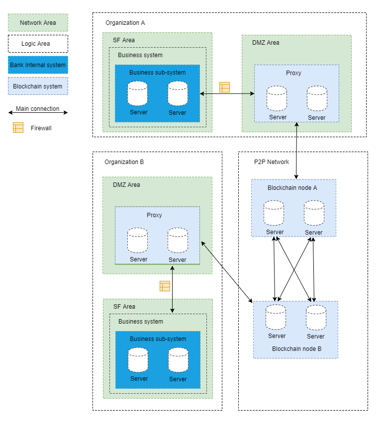

# AMOP(Advance Messages Onchain Protocol) Guidebook
**Author: fisco-dev**  
## Introduction
AMOP(Advance Messages Onchain Protocol) is aims to provide a safe and efficient message channel. In consortium chain, every organization which deployed the blockchain node, whether it is a consensus node or an observation node, can use AMOP as the message channel. AMOP has the following advantages:
- Real-time: AMOP messages do not depend on blockchain transactions and consensus. Messages are transmitted in real time between nodes with a delay of milliseconds.  
- Reliable: When the message is transmitted via AMOP, it will automatically search all feasible links in the blockchain network for communication, and as long as at least one link is available for both the sender and the receiver, the message is guaranteed to be reachable. 
- Efficient: AMOP message structure is concise, the processing logic is efficient, it only occupies a small amount of CPU, and makes full use of network bandwidth.
- Security: all communication links using SSL encryption and the encryption algorithm can be configured.
- Easy to use: No additional configuration is required as AMOP is embedded in the SDK.

## Logical Architecture
  
Take the typical IDC(Internet Data Center) architecture of the bank as an example:  
- SF(Server Farm) area: A business service area within an organizatioana. If there is no DMZ area, the sub-systems in SF area are using blockchain SDK. Conversely, configure the SDK to connect to the blockchain proxy of the DMZ area.
- DMZ(Demilitarized Zone) area: The external network isolation area inside the organization. optional, it needs to deploy proxy if needed.
- Blockchain P2P network: This area is a logical area which deploys blockchain nodes of each organization. The blockchain nodes can also be deployed inside the organization.

## Configuration
AMOP does not require any additional configuration, The following is a configuration example for SDK:
SDK configuration(Spring Bean):
```xml

<?xml version="1.0" encoding="UTF-8" ?>
<beans xmlns="http://www.springframework.org/schema/beans"
	xmlns:xsi="http://www.w3.org/2001/XMLSchema-instance" xmlns:p="http://www.springframework.org/schema/p"
	xmlns:tx="http://www.springframework.org/schema/tx" xmlns:aop="http://www.springframework.org/schema/aop"
	xmlns:context="http://www.springframework.org/schema/context"
	xsi:schemaLocation="http://www.springframework.org/schema/beans   
	http://www.springframework.org/schema/beans/spring-beans-2.5.xsd  
			http://www.springframework.org/schema/tx   
	http://www.springframework.org/schema/tx/spring-tx-2.5.xsd  
			http://www.springframework.org/schema/aop   
	http://www.springframework.org/schema/aop/spring-aop-2.5.xsd">
	
<!-- AMOP message processing thread pool configuration, Configure according to actual needs -->
<bean id="pool" class="org.springframework.scheduling.concurrent.ThreadPoolTaskExecutor">
	<property name="corePoolSize" value="50" />
	<property name="maxPoolSize" value="100" />
	<property name="queueCapacity" value="500" />
	<property name="keepAliveSeconds" value="60" />
	<property name="rejectedExecutionHandler">
		<bean class="java.util.concurrent.ThreadPoolExecutor.AbortPolicy" />
	</property>
</bean>

<!-- Block chain nodes configuration -->
<bean id="channelService" class="cn.webank.channel.client.Service">
	<property name="orgID" value="WB" /> <!-- Configure the organization's name -->
		<property name="allChannelConnections">
			<map>
				<entry key="WB"> <!-- Configure the organization's blockchain node list (If there is a DMZ, it is the proxy)-->
					<bean class="cn.webank.channel.handler.ChannelConnections">
						<property name="connectionsStr">
							<list>
								<value>NodeA@127.0.0.1:30333</value><!-- Format: Node name @ IP address: Port Node name can be any name -->
							</list>
						</property>
					</bean>
				</entry>
			</map>
		</property>
	</bean>
</bean>
```

Proxy configuration, If there is a DMZ:
```xml

<?xml version="1.0" encoding="UTF-8" ?>
<beans xmlns="http://www.springframework.org/schema/beans"
	xmlns:xsi="http://www.w3.org/2001/XMLSchema-instance" xmlns:p="http://www.springframework.org/schema/p"
	xmlns:tx="http://www.springframework.org/schema/tx" xmlns:aop="http://www.springframework.org/schema/aop"
	xmlns:context="http://www.springframework.org/schema/context"
	xsi:schemaLocation="http://www.springframework.org/schema/beans   
	http://www.springframework.org/schema/beans/spring-beans-2.5.xsd  
			http://www.springframework.org/schema/tx   
	http://www.springframework.org/schema/tx/spring-tx-2.5.xsd  
			http://www.springframework.org/schema/aop   
	http://www.springframework.org/schema/aop/spring-aop-2.5.xsd">
	
	<!-- Block chain nodes configuration -->
	<bean id="proxyServer" class="cn.webank.channel.proxy.Server">
		<property name="remoteConnections">
			<bean class="cn.webank.channel.handler.ChannelConnections">
				<property name="connectionsStr">
					<list>
						<value>NodeA@127.0.0.1:5051</value><!-- Format: Node name @ IP address: Port Node name can be any name -->
					</list>
				</property>
			</bean>
		</property>
		
		<property name="localConnections">
			<bean class="cn.webank.channel.handler.ChannelConnections">
			</bean>
		</property>
		<!-- Proxy listening port configuration, for SDK connection -->
		<property name="bindPort" value="30333"/>
	</bean>
</beans>
```

## SDK Usage
The messages sending and receiving via AMOP is based on the topic mechanism. The server sets up a topic first, then the client sends the message to the topic, afterward the server can receive the message.

AMOP supports multiple topic messages sending and receiving in the same blockchain network, and the topic supports any number of servers and clients. When multiple servers are subscribed to the same topic, messages from the topic are sent randomly to one of the available servers.

Server-side code example:

```java

package cn.webank.channel.test;

import java.util.ArrayList;
import java.util.List;

import org.slf4j.Logger;
import org.slf4j.LoggerFactory;
import org.springframework.context.ApplicationContext;
import org.springframework.context.support.ClassPathXmlApplicationContext;

import cn.webank.channel.client.Service;

public class Channel2Server {
	static Logger logger = LoggerFactory.getLogger(Channel2Server.class);
	
	public static void main(String[] args) throws Exception {
		if(args.length < 1) {
			System.out.println("Parameters: Receive topic");
			return;
		}
		
		String topic = args[0];

		ApplicationContext context = new ClassPathXmlApplicationContext("classpath:applicationContext.xml");
		Service service = context.getBean(Service.class);
		
		//config topic, support multiple topic
		List<String> topics = new ArrayList<String>();
		topics.add(topic);
		service.setTopics(topics);
		
		//handle PushCallback class, see Callback code
		PushCallback cb = new PushCallback();
		service.setPushCallback(cb);
		
		//run server
		service.run();
	}
}
```
Server-side PushCallback class example:

```java

package cn.webank.channel.test;

import java.time.LocalDateTime;
import java.time.format.DateTimeFormatter;

import org.slf4j.Logger;
import org.slf4j.LoggerFactory;

import cn.webank.channel.client.ChannelPushCallback;
import cn.webank.channel.dto.ChannelPush;
import cn.webank.channel.dto.ChannelResponse;

class PushCallback extends ChannelPushCallback {
	static Logger logger = LoggerFactory.getLogger(PushCallback2.class);
	
	//onPush function, Called when the AMOP message is received
	@Override
	public void onPush(ChannelPush push) {
		DateTimeFormatter df = DateTimeFormatter.ofPattern("yyyy-MM-dd HH:mm:ss");
		logger.debug("Received PUSH message:" + push.getContent());
		
		System.out.println(df.format(LocalDateTime.now()) + "server:Received PUSH message:" + push.getContent());
		
		//Response
		ChannelResponse response = new ChannelResponse();
		response.setContent("receive request seq:" + String.valueOf(push.getMessageID()));
		response.setErrorCode(0);
		
		push.sendResponse(response);
	}
}
```

Client-side example:

```java

package cn.webank.channel.test;

import java.time.LocalDateTime;
import java.time.format.DateTimeFormatter;
import java.util.Date;
import java.util.Random;

import org.slf4j.Logger;
import org.slf4j.LoggerFactory;
import org.springframework.context.ApplicationContext;
import org.springframework.context.support.ClassPathXmlApplicationContext;

import cn.webank.channel.client.Service;
import cn.webank.channel.dto.ChannelRequest;
import cn.webank.channel.dto.ChannelResponse;

public class Channel2Client {
	static Logger logger = LoggerFactory.getLogger(Channel2Client.class);
	
	public static void main(String[] args) throws Exception {
		if(args.length < 1) {
			System.out.println("Parameters: target topic");
			return;
		}
		
		String topic = args[0];
		
		DateTimeFormatter df = DateTimeFormatter.ofPattern("yyyy-MM-dd HH:mm:ss");

		ApplicationContext context = new ClassPathXmlApplicationContext("classpath:applicationContext.xml");

		Service service = context.getBean(Service.class);
		service.run();
		
		Thread.sleep(2000); //It takes a little time to set up the connection, and if the message is sent immediately, it will fail

		ChannelRequest request = new ChannelRequest();
		request.setToTopic(topic); //Set message's topic
		request.setMessageID(service.newSeq()); //Message sequence number that uniquely identifies a message, use newSeq() random generate
		request.setTimeout(5000); //Timeout of message
			
		request.setContent("request seq:" + request.getMessageID()); //Message content
			
		ChannelResponse response = service.sendChannelMessage2(request); //Send message
			
		System.out.println(df.format(LocalDateTime.now()) + "Received response seq:" + String.valueOf(response.getMessageID()) + ", Error code:" + response.getErrorCode() + ", message content:" + response.getContent());
	}
}
```

## Test
After configuring as described above, the user specifies a topic: topic, and the following two commands can be used for testing. 

Start AMOP server:

```
java -cp 'conf/:apps/*:lib/*' cn.webank.channel.test.Channel2Server [topic]
```  

Start AMOP client

```
java -cp 'conf/:apps/*:lib/*' cn.webank.channel.test.Channel2Client [topic] [message content] [Number of messages]
```

## Error Code

- 99: The message failed to be sent to the server after AMOP attempts to go through all links. Suggest to use the seq generated during sending to check the processing status of each node on the link.
- 102: Timeout. Suggest checking that if the server has handled the message correctly and if the bandwidth is adequate.
