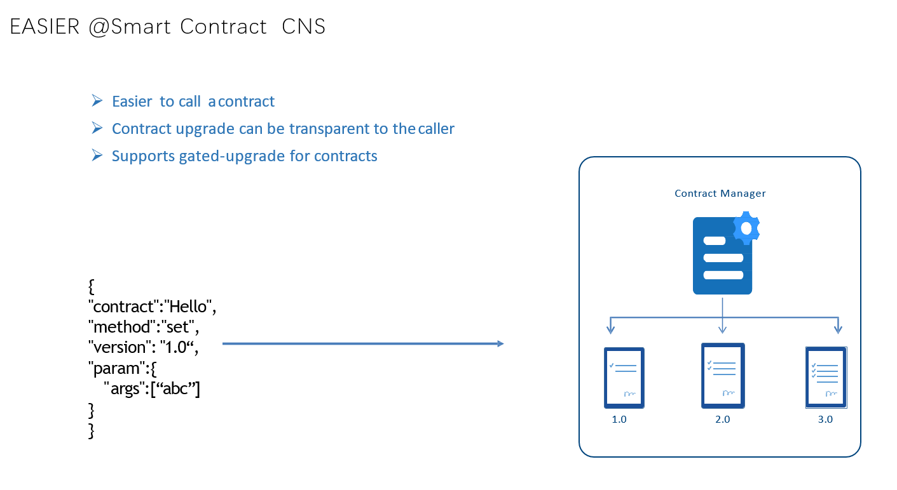
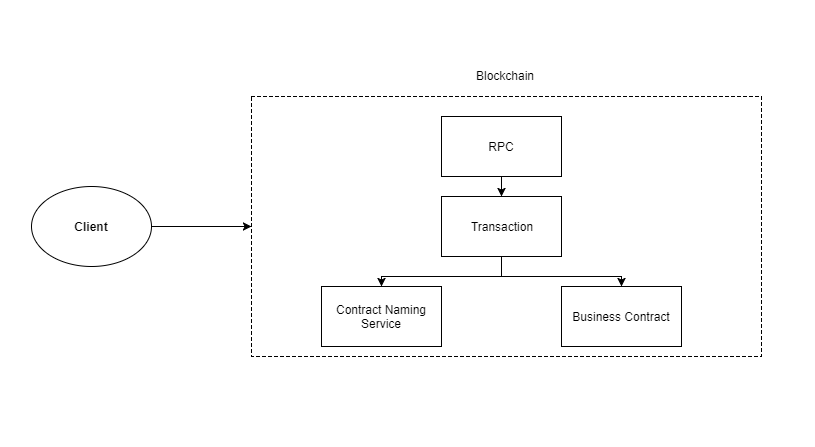

# CNS(Contract Name Service)

## Overview

### 1.Steps to call a Smart Contract

Implement a smart contract includes steps: coding, compiling, and deployment.
Take HelloWorld.sol as an example:

``` solidity
// HelloWorld.sol path: FISCO-BCOS/tool/HelloWorld.sol
pragma solidity ^0.4.2;
contract HelloWorld{
    string name;
    function HelloWorld(){
       name="Hi,Welcome!";
    }
    function get()constant returns(string){
        return name;
    }
    function set(string n){
        name=n;
    }
}
```

After compiling the contract, a description of the contract interface - ABI - had been provided as follows:

```json
[
  {
    "constant": false,
    "inputs": [
      {
        "name": "n",
        "type": "string"
      }
    ],
    "name": "set",
    "outputs": [
    ],
    "payable": false,
    "stateMutability": "nonpayable",
    "type": "function"
  },
  {
    "constant": true,
    "inputs": [
    ],
    "name": "get",
    "outputs": [
      {
        "name": "",
        "type": "string"
      }
    ],
    "payable": false,
    "stateMutability": "view",
    "type": "function"
  },
  {
    "inputs": [
    ],
    "payable": false,
    "stateMutability": "nonpayable",
    "type": "constructor"
  }
]
```

Then deploy the contract to the blockchain and get an address, for example: 0x269ab4bc23b07efeb3c3fd52eecfc4cbe6a50859.
Finally, use the ABI and address to call the contract. The key input parameters are ABI and address even there are various SDK tools. 

### 2. Brief to CNS

ABI and contract address are mandatory in the calling process. There are below inconveniences:

1. The ABI is a long JSON string, not user-friendly.
2. Contract address is a magic number which is hard to remember. The contracts will be lost if the address had been forgotten.
3. The contract address changes for each deployment.
4. Difficult to handle version management and contract gated-upgrade.

The CNS hold a mapping between contract name and its ABI/address.
When calling by CNS, pass the CNS name, version, function name and associated parameters. And then the CNS Manager module in framework will translate it to the exactly ABI and address for binary execution in EVM.

Below diagram shows the process and its advantages:



1. No need to maintain unfriendly ABI and contract address any more.
2. Only needs the CNS name, interface and parameter.
3. Built-in version management and gated-upgrade features.

## How it works

### 1. Overall framework



The client calls the contract service by RPC, first it will visit contract naming service to get underlying business contract details(ABI and address), then constructing a call to business smart contract by its ABI and address, and finally return the results to the client.

### 2. Key components

#### a. Contract Management

In contract management, there is a mapping between the name and contract information. contract information including contract address, ABI and version number etc., and an external assistive tool (cns_manager.js) can provides add, update, override and reset features. In the meantime, there is a contract backup in the underlying memory and the memory is updated synchronously when contract changes.

- The current CNS mapping: contract name + contract version number => contract details (ABI, address etc.)
- Implementation: systemcontractv2/ContractAbiMgr.sol  
- Assistive Contract: tool/ContractBase.sol
- Providing multi-version management which allows the contract to inherit from ContractBase.sol, and initialize the version member in the constructor.
- Note: ContractAbiMgr is maintained in the system contract, so deploy the system contract first when using the CNS.

#### b. Assistive Tools

Provide add, update, override and reset features.

- Tool: tool/cns_manager.js  

```
babel-node cns_manager.js 
 cns_manager.js Usage: 
         babel-node cns_manager.js get    contractName [contractVersion]
         babel-node cns_manager.js add    contractName
         babel-node cns_manager.js update contractName
         babel-node cns_manager.js list [simple]
         babel-node cns_manager.js historylist contractName [contractVersion] [simple]
         babel-node cns_manager.js reset contractName [contractVersion] index

```

- Command    : add  
  Parameter  : contractName  
  Function   : add contractName to contract management  
  Note       : If the contractName already exists then the operation will fail. So need: 1. Update the current contract version number - specify the version number during call CNS. 2. Update forcibly to overwrite.

```javascript
//first time add Test, success
babel-node cns_manager.js add Test
cns add operation => cns_name = Test
         cns_name =>Test
         contract =>Test
         version  =>
         address  =>0x233c777fccb9897ad5537d810068f9c6a4344e4a
         abi      =>[{"constant":false,"inputs":[{"name":"num","type":"uint256"}],"name":"trans","outputs":[],"payable":false,"stateMutability":"nonpayable","type":"function"},{"constant":true,"inputs":[],"name":"get","outputs":[{"name":"","type":"uint256"}],"payable":false,"stateMutability":"view","type":"function"},{"constant":false,"inputs":[],"name":"Ok","outputs":[],"payable":false,"stateMutability":"nonpayable","type":"function"}]

//second time add, failed
babel-node cns_manager.js add Test
cns_manager.js  ........................Begin........................
 [WARNING] cns add operation failed , ====> contract => Test version =>  is already exist. you can update it or change its version.
```
- Command   : get  
  Parameter : 1. contractName  2. contractVersion [optional]  
  Feature    : Get contractName corresponding contractVersion

```javascript
babel-node cns_manager.js get HelloWorld
cns_manager.js  ........................Begin........................
 ====> contract => HelloWorld ,version => 
         contract    = HelloWorld
         version     = 
         address     = 0x269ab4bc23b07efeb3c3fd52eecfc4cbe6a50859
         timestamp   = 1516866720115 => 2018/1/25 15:52:0:115
         abi         = [{"constant":false,"inputs":[{"name":"n","type":"string"}],"name":"set","outputs":[],"payable":false,"stateMutability":"nonpayable","type":"function"},{"constant":true,"inputs":[],"name":"get","outputs":[{"name":"","type":"string"}],"payable":false,"stateMutability":"view","type":"function"},{"inputs":[],"payable":false,"stateMutability":"nonpayable","type":"constructor"}]
```
- Command   : update 
  Parameter : contractName
  Feature    : Update contractName  
  Note      : If the contractName corresponding contractVersion not exists then the operation will fail. So need add first; The overwritten information can be queried by historylistCommand and reset by resetCommand.

```javascript
babel-node cns_manager.js update Test
cns_manager.js  ........................Begin........................
 ====> Are you sure update the cns of the contract ?(Y/N)
Y
cns update operation => cns_name = Test
         cns_name =>Test
         contract =>Test
         version  =>
         address  =>0x233c777fccb9897ad5537d810068f9c6a4344e4a
         abi      =>[{"constant":false,"inputs":[{"name":"num","type":"uint256"}],"name":"trans","outputs":[],"payable":false,"stateMutability":"nonpayable","type":"function"},{"constant":true,"inputs":[],"name":"get","outputs":[{"name":"","type":"uint256"}],"payable":false,"stateMutability":"view","type":"function"},{"constant":false,"inputs":[],"name":"Ok","outputs":[],"payable":false,"stateMutability":"nonpayable","type":"function"}]
Send transaction successfully: 0x1d3caff1fba49f5ad8af3d195999454d01c64d236d9ac3ba91350dd543b10c13
```
- Command   : list 
  Parameter : [simple]
  Feature    : List all the information. If no simple parameter then prints the contract details, else prints only the contract name and version number.

```javascript
babel-node cns_manager.js list simple
cns_manager.js  ........................Begin........................
 cns total count => 11
        1. contract = ContractAbiMgr ,version = 
        2. contract = SystemProxy ,version = 
        3. contract = TransactionFilterChain ,version = 
        4. contract = AuthorityFilter ,version = 
        5. contract = Group ,version = 
        6. contract = CAAction ,version = 
        7. contract = ConfigAction ,version = 
        8. contract = NodeAction ,version = 
        9. contract = HelloWorld ,version = 
        10. contract = Ok ,version = 
        11. contract = Test ,version = 
```

- Command   : historylist 
  Parameter : 1. contractName  2. contractVersion [optional] 
  Feature    : List all contract information overwritten by the update
```javascript
babel-node cns_manager.js historylist HelloWorld
cns_manager.js  ........................Begin........................
 cns history total count => 3
 ====> cns history list index = 0 <==== 
         contract    = HelloWorld
         version     = 
         address     = 0x1d2047204130de907799adaea85c511c7ce85b6d
         timestamp   = 1516865606159 => 2018/1/25 15:33:26:159
         abi         = [{"constant":false,"inputs":[{"name":"n","type":"string"}],"name":"set","outputs":[],"payable":false,"stateMutability":"nonpayable","type":"function"},{"constant":true,"inputs":[],"name":"get","outputs":[{"name":"","type":"string"}],"payable":false,"stateMutability":"view","type":"function"},{"inputs":[],"payable":false,"stateMutability":"nonpayable","type":"constructor"}]
 ====> cns history list index = 1 <==== 
         contract    = HelloWorld
         version     = 
         address     = 0x9c3fb4dd0a3fc5e1ea86ed3d3271b173a7084f24
         timestamp   = 1516866516542 => 2018/1/25 15:48:36:542
         abi         = [{"constant":false,"inputs":[{"name":"n","type":"string"}],"name":"set","outputs":[],"payable":false,"stateMutability":"nonpayable","type":"function"},{"constant":true,"inputs":[],"name":"get","outputs":[{"name":"","type":"string"}],"payable":false,"stateMutability":"view","type":"function"},{"inputs":[],"payable":false,"stateMutability":"nonpayable","type":"constructor"}]
 ====> cns history list index = 2 <==== 
         contract    = HelloWorld
         version     = 
         address     = 0x1d2047204130de907799adaea85c511c7ce85b6d
         timestamp   = 1516866595160 => 2018/1/25 15:49:55:160
         abi         = [{"constant":false,"inputs":[{"name":"n","type":"string"}],"name":"set","outputs":[],"payable":false,"stateMutability":"nonpayable","type":"function"},{"constant":true,"inputs":[],"name":"get","outputs":[{"name":"","type":"string"}],"payable":false,"stateMutability":"view","type":"function"},{"inputs":[],"payable":false,"stateMutability":"nonpayable","type":"constructor"}]

```
- Command   : reset 
  Parameter : 1. contractName  2. contractVersion [optional] 3. index  
  Feature    : Reset the overwritten information, index is the index of the historylist

#### c. RPC

Modify RPC to support CNS call:
> Note: Only RPC interface has been modified so the original request is compatible.
> RPC format details:https://github.com/ethereum/wiki/wiki/JSON-RPC  

- eth_call  
```json  
request:
{
  "jsonrpc": "2.0",
  "method": "eth_call",
  "params": [
    {
      "data": {
        "contract": "",
        "version": "",
        "func": "",
        "params": [

        ]
      }
    },
    "latest"
  ],
  "id": 1
}

response:
{
  "id": 1,
  "jsonrpc": "2.0",
  "result": {
    "result": [],         //return result, json format
    "ret_code": 0,
    "ret_msg": "success!"
  }
}

```

- eth_sendTransaction
```json
request:
{
  "jsonrpc": "2.0",
  "method": "eth_sendTransaction",
  "params": [
    {
      "data": {
        "contract": "",
        "version": "",
        "func": "",
        "params": [
        ]
      },
      "randomid": "2"
    }
  ],
  "id": 1
}

response:
{
  "id": 1,
  "jsonrpc": "2.0",
  "result": "" //transaction hash
}
```

- eth_sendRawTransaction
  The RPC request and response format are exactly the same as before. The difference is that the previous hex rlp string changed to:

```json
"data": {
        "contract": "",
        "version": "",
        "func": "",
        "params": [
        
        ]
      }
```
#### d. JS Encapsulation
Path: web3lib/web3sync.js  
Interface:
```
callByNameService  
sendRawTransactionByNameService
```

## Examples
Here is some examples of CNS usage for your reference

```solidity
// Test contract
// Path tool/HelloWorld.sol
pragma solidity ^0.4.4;
contract HelloWorld{
    string name;
    function HelloWorld(){
       name="Hi,Welcome!";
    }
    function get()constant public returns(string){
        return name;
    }
    function set(string n) public{
        name=n;
    }
}
```

- Deployment:  
  babel-node deploy.js HelloWorld  
>   In depoy.js, the cns_mangager add function is called by default when deployed successfully, and the file name is same as the contract name. If add failed then need:  
1. If file name is not same as the contract name then needs to call 'cns_manager add' again. 
2. If it's just the test contract then no need handle.
3. If the same contract needs upgrade, then needs execute update.
4. If the currently contract needs call CNS, then needs modifies the contract's version number (refer to multi-version deployment).
```javascript
    //examples of success
    babel-node deploy.js Test0
    deploy.js  ........................Start........................
    Soc File :Test0
    Test0Compiled successfully！
    Test0Contract address 0xfc7055a9dc68ff79a58ce4f504d8c780505b2267
    Test0Deployed successful ！
    cns add operation => cns_name = Test0
             cns_name =>Test0
             contract =>Test0
             version  =>
             address  =>0xfc7055a9dc68ff79a58ce4f504d8c780505b2267
             abi      =>[{"constant":false,"inputs":[{"name":"n","type":"string"}],"name":"set","outputs":[],"payable":false,"stateMutability":"nonpayable","type":"function"},{"constant":true,"inputs":[],"name":"get","outputs":[{"name":"","type":"string"}],"payable":false,"stateMutability":"view","type":"function"},{"constant":false,"inputs":[],"name":"HelloWorld","outputs":[],"payable":false,"stateMutability":"nonpayable","type":"function"}]
    Send transaction successfully: 0x84d1e6b16c58e3571f79e80588472ab8d12779234e75ceed4ac592ad1d653086

    //Example of failure, the contract already has corresponding information
    babel-node deploy.js HelloWorld
    deploy.js  ........................Start........................
    Soc File :HelloWorld
    HelloWorldCompiled successfully！
    HelloWorldContract address 0xc3869f3d9a5fc728de82cc9c807e85b77259aa3a
    HelloWorldDeployed successful ！
     [WARNING] cns add operation failed , ====> contract => HelloWorld version =>  is already exist. you can update it or change its version.
     
```
-Multi-version Deployment  
For add operation, if the version number already exists, then add fail, but can be updated, and inherite the specific version number by ContractBase.sol.
```solidity
pragma solidity ^0.4.4;
contract HelloWorld is ContractBase("v-1.0"){
    string name;
    function HelloWorld(){
       name="Hi,Welcome!";
    }
    function get()constant public returns(string){
        return name;
    }
    function set(string n) public{
        name=n;
    }
}
```
deploy again
```shell  
babel-node deploy.js HelloWorld
deploy.js  ........................Start........................
Soc File :HelloWorld
HelloWorldCompiled successfully！
HelloWorldContract address 0x027d156c260110023e5bd918cc243ac12be45b17
HelloWorldDeployed successful ！
cns add operation => cns_name = HelloWorld/v-1.0
         cns_name =>HelloWorld/v-1.0
         contract =>HelloWorld
         version  =>v-1.0
         address  =>0x027d156c260110023e5bd918cc243ac12be45b17
         abi      =>[{"constant":true,"inputs":[],"name":"getVersion","outputs":[{"name":"","type":"string"}],"payable":false,"stateMutability":"view","type":"function"},{"constant":false,"inputs":[{"name":"n","type":"string"}],"name":"set","outputs":[],"payable":false,"stateMutability":"nonpayable","type":"function"},{"constant":true,"inputs":[],"name":"get","outputs":[{"name":"","type":"string"}],"payable":false,"stateMutability":"view","type":"function"},{"constant":false,"inputs":[{"name":"version_para","type":"string"}],"name":"setVersion","outputs":[],"payable":false,"stateMutability":"nonpayable","type":"function"},{"inputs":[],"payable":false,"stateMutability":"nonpayable","type":"constructor"}]
Send transaction successfully: 0x9a409003f5a17220809dd8e1324a36a425acaf194efd3ef1f772bbf7b49ee67c
```
Now the contract version number is v-1.0

- RPC calls
```shell

1. Call HelloWorld default version(no specific version number) set
curl -X POST --data  '{"jsonrpc":"2.0","method":"eth_sendTransaction","params":[{"data":{"contract":"HelloWorld","version":"","func":"set","params":["call defaut version"]},"randomid":"3"}],"id":1}'  "http://127.0.0.1:8746"  

{"id":1,"jsonrpc":"2.0","result":"0x77218708a73aa8c17fb9370a29254baa8f504e71b12d01d90eae0b2ef9818172"}

2. Call HelloWorld default version(no specific version number) get
curl -X POST --data  '{"jsonrpc":"2.0","method":"eth_call","params":[{"data":{"contract":"HelloWorld","version":"","func":"get","params":[]}},"latest"],"id":1}'  "http://127.0.0.1:8746"  

{"id":1,"jsonrpc":"2.0","result":"[\"call defaut version\"]\n"}

3. Call HelloWorld version v-1.0 set
curl -X POST --data  '{"jsonrpc":"2.0","method":"eth_sendTransaction","params":[{"data":{"contract":"HelloWorld","version":"v-1.0","func":"set","params":["call v-1.0 version"]},"randomid":"4"}],"id":1}'  "http://127.0.0.1:8746"  

{"id":1,"jsonrpc":"2.0","result":"0xf43349d7be554fd332e8e4eb0c69e23292ffa8d127b0500c21109b60784aaa1d"}

4. Call HelloWorld version v-1.0 get
 curl -X POST --data  '{"jsonrpc":"2.0","method":"eth_call","params":[{"data":{"contract":"HelloWorld","version":"v-1.0","func":"get","params":[]}},"latest"],"id":1}'  "http://127.0.0.1:8746"  

{"id":1,"jsonrpc":"2.0","result":"[\"call v-1.0 version\"]\n"}
```

- Contract upgrade  
  If upgrade HelloWorld, needs redeploy first, but as cns_manager already added HelloWorld before, so it will prompt to add failure, then executes the update.
```javascrpt
babel-node cns_manager.js update HelloWorld
cns_manager.js  ........................Begin........................
 ====> Are you sure update the cns of the contract ?(Y/N)
Y
cns update operation => cns_name = HelloWorld
         cns_name =>HelloWorld
         contract =>HelloWorld
         version  =>
         address  =>0x93d62e961a6801d3f614a5add207cdf45b0ff654
         abi      =>[{"constant":false,"inputs":[{"name":"n","type":"string"}],"name":"set","outputs":[],"payable":false,"stateMutability":"nonpayable","type":"function"},{"constant":true,"inputs":[],"name":"get","outputs":[{"name":"","type":"string"}],"payable":false,"stateMutability":"view","type":"function"},{"inputs":[],"payable":false,"stateMutability":"nonpayable","type":"constructor"}]
Send transaction successfully: 0xc8ee384185a1aaa3817474d6db6394ff6871a7bc56a15e564e7b1f57c8bfda1a

Call get interface again:
curl -X POST --data  '{"jsonrpc":"2.0","method":"eth_call","params":[{"data":{"contract":"HelloWorld","version":"","func":"get","params":[]}},"latest"],"id":1}'  "http://127.0.0.1:8746"  
{"id":1,"jsonrpc":"2.0","result":"[\"Hi,Welcome!\"]\n"}

Return 'Hi,Welcome!'.
That means the current contract is the newly deployed contract.

```
- Contract reset  
  If needs to retrieve the original contract after the update, then use reset.
  First, find out how many updates are overwritten by the current version contract.
```javascript
babel-node cns_manager.js historylist HelloWorld
cns_manager.js  ........................Begin........................
 cns history total count => 4
 ====> cns history list index = 0 <==== 
         contract    = HelloWorld
         version     = 
         address     = 0x1d2047204130de907799adaea85c511c7ce85b6d
         timestamp   = 1516865606159 => 2018/1/25 15:33:26:159
         abi         = [{"constant":false,"inputs":[{"name":"n","type":"string"}],"name":"set","outputs":[],"payable":false,"stateMutability":"nonpayable","type":"function"},{"constant":true,"inputs":[],"name":"get","outputs":[{"name":"","type":"string"}],"payable":false,"stateMutability":"view","type":"function"},{"inputs":[],"payable":false,"stateMutability":"nonpayable","type":"constructor"}]
 ====> cns history list index = 1 <==== 
         contract    = HelloWorld
         version     = 
         address     = 0x9c3fb4dd0a3fc5e1ea86ed3d3271b173a7084f24
         timestamp   = 1516866516542 => 2018/1/25 15:48:36:542
         abi         = [{"constant":false,"inputs":[{"name":"n","type":"string"}],"name":"set","outputs":[],"payable":false,"stateMutability":"nonpayable","type":"function"},{"constant":true,"inputs":[],"name":"get","outputs":[{"name":"","type":"string"}],"payable":false,"stateMutability":"view","type":"function"},{"inputs":[],"payable":false,"stateMutability":"nonpayable","type":"constructor"}]
 ====> cns history list index = 2 <==== 
         contract    = HelloWorld
         version     = 
         address     = 0x1d2047204130de907799adaea85c511c7ce85b6d
         timestamp   = 1516866595160 => 2018/1/25 15:49:55:160
         abi         = [{"constant":false,"inputs":[{"name":"n","type":"string"}],"name":"set","outputs":[],"payable":false,"stateMutability":"nonpayable","type":"function"},{"constant":true,"inputs":[],"name":"get","outputs":[{"name":"","type":"string"}],"payable":false,"stateMutability":"view","type":"function"},{"inputs":[],"payable":false,"stateMutability":"nonpayable","type":"constructor"}]
 ====> cns history list index = 3 <==== 
         contract    = HelloWorld
         version     = 
         address     = 0x269ab4bc23b07efeb3c3fd52eecfc4cbe6a50859
         timestamp   = 1516866720115 => 2018/1/25 15:52:0:115
         abi         = [{"constant":false,"inputs":[{"name":"n","type":"string"}],"name":"set","outputs":[],"payable":false,"stateMutability":"nonpayable","type":"function"},{"constant":true,"inputs":[],"name":"get","outputs":[{"name":"","type":"string"}],"payable":false,"stateMutability":"view","type":"function"},{"inputs":[],"payable":false,"stateMutability":"nonpayable","type":"constructor"}]

Then find out which contract need to be retrieved.
babel-node cns_manager.js reset HelloWorld 3
cns_manager.js  ........................Begin........................
 ====> Are you sure update the cns of the contract ?(Y/N)
Y
cns update operation => cns_name = HelloWorld
         cns_name =>HelloWorld
         contract =>HelloWorld
         version  =>
         address  =>0x269ab4bc23b07efeb3c3fd52eecfc4cbe6a50859
         abi      =>[{"constant":false,"inputs":[{"name":"n","type":"string"}],"name":"set","outputs":[],"payable":false,"stateMutability":"nonpayable","type":"function"},{"constant":true,"inputs":[],"name":"get","outputs":[{"name":"","type":"string"}],"payable":false,"stateMutability":"view","type":"function"},{"inputs":[],"payable":false,"stateMutability":"nonpayable","type":"constructor"}]
Send transaction successfully: 0x4809a6105916a483ca70c4efe8e306bc01ca5d937515320d09e94a83f4a91b76

Then call HelloWorld get interface again:
curl -X POST --data  '{"jsonrpc":"2.0","method":"eth_call","params":[{"data":{"contract":"HelloWorld","version":"","func":"get","params":[]}},"latest"],"id":1}'  "http://127.0.0.1:8746"  
{"id":1,"jsonrpc":"2.0","result":"[\"call defaut version\"]\n"}

The response is defaut version, means that is the last overwritten contract.
```

- jsCall   

```javascript
//Call HelloWorld get
var result = web3sync.callByNameService("HelloWorld","get","",[]);  

//Call HelloWorld v-1.0 get
var result = web3sync.callByNameService("HelloWorld","get","v-1.0",[]);  

//Call HelloWorld set sendRawTransaction
var result = web3sync.sendRawTransactionByNameService(config.account,config.privKey,"HelloWorld","set","",["test message!"]);  

//Call HelloWorld v-1.0 set sendRawTransaction
var result = web3sync.sendRawTransactionByNameService(config.account,config.privKey,"HelloWorld","set","v-1.0",["test message!"]); 
```

## Appendix One: Function overloading   
solidity support function loading. The parameters are different when there are overloaded functions:

```
//file : OverloadTest.sol
pragma solidity ^0.4.4;
contract OverloadTest {
    string public msg;
    uint256 public u;
    
    function OverloadTest() {
        msg = "OverloadTest Test";
        u = 0x01;
    }
    
    function set(string _msg) public {
        msg = _msg;
    }
    function set(uint256 _u) public {
        u = _u;
    }
    
    function get() public constant returns(string){
        return msg;
    }
    
    function get(uint256 i) public constant returns(uint256){
        return u;
    }
}
```
In OverloadTest.sol:  
set function is a overload function, one function prototype is set(string), the other one is set(uint256).  
get function is also a overload function,, one function prototype is get(), the other one is get(uint256).

Deployment:

```
babel-node deploy.js OverloadTest
RPC=http://0.0.0.0:8546
Ouputpath=./output/
deploy.js  ........................Start........................
OverloadTest Compiled successfully！
Send transaction successfully: 0xff8a5708b3f7b335570a50639f2073e5e0b8b2002faa909dc75727059de94f4e
OverloadTest Contract address 0x919868496524eedc26dbb81915fa1547a20f8998
OverloadTest Deployed successful！
cns add operation => cns_name = OverloadTest
         cns_name =>OverloadTest
         contract =>OverloadTest
         version  =>
         address  =>0x919868496524eedc26dbb81915fa1547a20f8998
         abi      =>[{"constant":false,"inputs":[{"name":"_msg","type":"string"}],"name":"set","outputs":[],"payable":false,"type":"function"},{"constant":false,"inputs":[{"name":"_u","type":"uint256"}],"name":"set","outputs":[],"payable":false,"type":"function"},{"constant":true,"inputs":[],"name":"msg","outputs":[{"name":"","type":"string"}],"payable":false,"type":"function"},{"constant":true,"inputs":[],"name":"get","outputs":[{"name":"","type":"string"}],"payable":false,"type":"function"},{"constant":true,"inputs":[{"name":"i","type":"uint256"}],"name":"get","outputs":[{"name":"","type":"uint256"}],"payable":false,"type":"function"},{"constant":true,"inputs":[],"name":"u","outputs":[{"name":"","type":"uint256"}],"payable":false,"type":"function"},{"inputs":[],"payable":false,"type":"constructor"}]
===>> namecall params = {"contract":"ContractAbiMgr","func":"addAbi","version":"","params":["OverloadTest","OverloadTest","","[{\"constant\":false,\"inputs\":[{\"name\":\"_msg\",\"type\":\"string\"}],\"name\":\"set\",\"outputs\":[],\"payable\":false,\"type\":\"function\"},{\"constant\":false,\"inputs\":[{\"name\":\"_u\",\"type\":\"uint256\"}],\"name\":\"set\",\"outputs\":[],\"payable\":false,\"type\":\"function\"},{\"constant\":true,\"inputs\":[],\"name\":\"msg\",\"outputs\":[{\"name\":\"\",\"type\":\"string\"}],\"payable\":false,\"type\":\"function\"},{\"constant\":true,\"inputs\":[],\"name\":\"get\",\"outputs\":[{\"name\":\"\",\"type\":\"string\"}],\"payable\":false,\"type\":\"function\"},{\"constant\":true,\"inputs\":[{\"name\":\"i\",\"type\":\"uint256\"}],\"name\":\"get\",\"outputs\":[{\"name\":\"\",\"type\":\"uint256\"}],\"payable\":false,\"type\":\"function\"},{\"constant\":true,\"inputs\":[],\"name\":\"u\",\"outputs\":[{\"name\":\"\",\"type\":\"uint256\"}],\"payable\":false,\"type\":\"function\"},{\"inputs\":[],\"payable\":false,\"type\":\"constructor\"}]","0x919868496524eedc26dbb81915fa1547a20f8998"]}
Send transaction successfully: 0x56e2267cd46fddc11abc4f38d605adc1f76d3061b96cf4026b09ace3502d2979
```

> **For overload function, needs to specify the complete function prototype, other than just the function name.**:

When call get()， "func" is "get()";
When call get(uint256 i), "func" is "get(uint256)";  
When call set(string _msg), "func" is "set(string)";  
When call set(uint256 _u), "func" is "set(uint256)";  

Example:  

```
Call get():
curl -X POST --data  '{"jsonrpc":"2.0","method":"eth_call","params":[{"data":{"contract":"OverloadTest","version":"","func":"get","params":[]}},"latest"],"id":1}'  "http://127.0.0.1:8546"  
{"id":1,"jsonrpc":"2.0","result":"[\"OverloadTest Test\"]\n"}

Call get(uint256 i):
curl -X POST --data  '{"jsonrpc":"2.0","method":"eth_call","params":[{"data":{"contract":"OverloadTest","version":"","func":"get(uint256)","params":[1]}},"latest"],"id":1}'  "http://127.0.0.1:8546"  
{"id":1,"jsonrpc":"2.0","result":"[\"1\"]\n"}

jsCall set(string _msg):
var result = web3sync.sendRawTransactionByNameService(config.account,config.privKey,"OverloadTest","set(string)","",["test message!"]);
 
jsCall set(uint256 _i)):
var result = web3sync.sendRawTransactionByNameService(config.account,config.privKey,"OverloadTest","set(uint256)","",["0x111"]);
```

## Appendix two: Java usage.  

Let's still use the HelloWorld.sol contract as an example.

1. Deploy HelloWorld.sol and use the cns_manager.js to register HelloWorld to CNS management contract.
2. Download web3sdk, the version number needs >= V1.1.0. web3sdk: https://github.com/FISCO-BCOS/web3sdk
3. The java wrap code [reference tutorial](https://github.com/FISCO-BCOS/web3sdk#五合约编译及java-wrap代码生成) using web3sdk generate HelloWorld. The package name is org.bcos.cns, code as below:
```java
package org.bcos.cns;

import java.math.BigInteger;
import java.util.Arrays;
import java.util.Collections;
import java.util.concurrent.Future;
import org.bcos.channel.client.TransactionSucCallback;
import org.bcos.web3j.abi.TypeReference;
import org.bcos.web3j.abi.datatypes.Function;
import org.bcos.web3j.abi.datatypes.Type;
import org.bcos.web3j.abi.datatypes.Utf8String;
import org.bcos.web3j.crypto.Credentials;
import org.bcos.web3j.protocol.Web3j;
import org.bcos.web3j.protocol.core.methods.response.TransactionReceipt;
import org.bcos.web3j.tx.Contract;
import org.bcos.web3j.tx.TransactionManager;

/**
 * Auto generated code.<br>
 * <strong>Do not modify!</strong><br>
 * Please use the <a href="https://docs.web3j.io/command_line.html">web3j command line tools</a>, or {@link org.bcos.web3j.codegen.SolidityFunctionWrapperGenerator} to update.
 *
 * <p>Generated with web3j version none.
 */
public final class HelloWorld extends Contract {
    private static final String BINARY = "6060604052341561000c57fe5b5b604060405190810160405280600b81526020017f48692c57656c636f6d652100000000000000000000000000000000000000000081525060009080519060200190610059929190610060565b505b610105565b828054600181600116156101000203166002900490600052602060002090601f016020900481019282601f106100a157805160ff19168380011785556100cf565b828001600101855582156100cf579182015b828111156100ce5782518255916020019190600101906100b3565b5b5090506100dc91906100e0565b5090565b61010291905b808211156100fe5760008160009055506001016100e6565b5090565b90565b6102e2806101146000396000f30060606040526000357c0100000000000000000000000000000000000000000000000000000000900463ffffffff1680634ed3885e146100465780636d4ce63c146100a0575bfe5b341561004e57fe5b61009e600480803590602001908201803590602001908080601f01602080910402602001604051908101604052809392919081815260200183838082843782019150505050505091905050610139565b005b34156100a857fe5b6100b0610154565b60405180806020018281038252838181518152602001915080519060200190808383600083146100ff575b8051825260208311156100ff576020820191506020810190506020830392506100db565b505050905090810190601f16801561012b5780820380516001836020036101000a031916815260200191505b509250505060405180910390f35b806000908051906020019061014f9291906101fd565b505b50565b61015c61027d565b60008054600181600116156101000203166002900480601f0160208091040260200160405190810160405280929190818152602001828054600181600116156101000203166002900480156101f25780601f106101c7576101008083540402835291602001916101f2565b820191906000526020600020905b8154815290600101906020018083116101d557829003601f168201915b505050505090505b90565b828054600181600116156101000203166002900490600052602060002090601f016020900481019282601f1061023e57805160ff191683800117855561026c565b8280016001018555821561026c579182015b8281111561026b578251825591602001919060010190610250565b5b5090506102799190610291565b5090565b602060405190810160405280600081525090565b6102b391905b808211156102af576000816000905550600101610297565b5090565b905600a165627a7a723058205f78cf9b4365c5a429ff9e4ebc4abf1f9e9d44f0a41c19c85c9d394438f3fe7b0029";

    public static final String ABI = "[{\"constant\":false,\"inputs\":[{\"name\":\"n\",\"type\":\"string\"}],\"name\":\"set\",\"outputs\":[],\"payable\":false,\"type\":\"function\"},{\"constant\":true,\"inputs\":[],\"name\":\"get\",\"outputs\":[{\"name\":\"\",\"type\":\"string\"}],\"payable\":false,\"type\":\"function\"},{\"inputs\":[],\"payable\":false,\"type\":\"constructor\"}]";

    private HelloWorld(String contractAddress, Web3j web3j, Credentials credentials, BigInteger gasPrice, BigInteger gasLimit, Boolean isInitByName) {
        super(BINARY, contractAddress, web3j, credentials, gasPrice, gasLimit, isInitByName);
    }

    private HelloWorld(String contractAddress, Web3j web3j, TransactionManager transactionManager, BigInteger gasPrice, BigInteger gasLimit, Boolean isInitByName) {
        super(BINARY, contractAddress, web3j, transactionManager, gasPrice, gasLimit, isInitByName);
    }

    private HelloWorld(String contractAddress, Web3j web3j, Credentials credentials, BigInteger gasPrice, BigInteger gasLimit) {
        super(BINARY, contractAddress, web3j, credentials, gasPrice, gasLimit, false);
    }

    private HelloWorld(String contractAddress, Web3j web3j, TransactionManager transactionManager, BigInteger gasPrice, BigInteger gasLimit) {
        super(BINARY, contractAddress, web3j, transactionManager, gasPrice, gasLimit, false);
    }

    public Future<TransactionReceipt> set(Utf8String n) {
        Function function = new Function("set", Arrays.<Type>asList(n), Collections.<TypeReference<?>>emptyList());
        return executeTransactionAsync(function);
    }

    public void set(Utf8String n, TransactionSucCallback callback) {
        Function function = new Function("set", Arrays.<Type>asList(n), Collections.<TypeReference<?>>emptyList());
        executeTransactionAsync(function, callback);
    }

    public Future<Utf8String> get() {
        Function function = new Function("get", 
                Arrays.<Type>asList(), 
                Arrays.<TypeReference<?>>asList(new TypeReference<Utf8String>() {}));
        return executeCallSingleValueReturnAsync(function);
    }

    public static Future<HelloWorld> deploy(Web3j web3j, Credentials credentials, BigInteger gasPrice, BigInteger gasLimit, BigInteger initialWeiValue) {
        return deployAsync(HelloWorld.class, web3j, credentials, gasPrice, gasLimit, BINARY, "", initialWeiValue);
    }

    public static Future<HelloWorld> deploy(Web3j web3j, TransactionManager transactionManager, BigInteger gasPrice, BigInteger gasLimit, BigInteger initialWeiValue) {
        return deployAsync(HelloWorld.class, web3j, transactionManager, gasPrice, gasLimit, BINARY, "", initialWeiValue);
    }

    public static HelloWorld load(String contractAddress, Web3j web3j, Credentials credentials, BigInteger gasPrice, BigInteger gasLimit) {
        return new HelloWorld(contractAddress, web3j, credentials, gasPrice, gasLimit, false);
    }

    public static HelloWorld load(String contractAddress, Web3j web3j, TransactionManager transactionManager, BigInteger gasPrice, BigInteger gasLimit) {
        return new HelloWorld(contractAddress, web3j, transactionManager, gasPrice, gasLimit, false);
    }

    public static HelloWorld loadByName(String contractName, Web3j web3j, Credentials credentials, BigInteger gasPrice, BigInteger gasLimit) {
        return new HelloWorld(contractName, web3j, credentials, gasPrice, gasLimit, true);
    }

    public static HelloWorld loadByName(String contractName, Web3j web3j, TransactionManager transactionManager, BigInteger gasPrice, BigInteger gasLimit) {
        return new HelloWorld(contractName, web3j, transactionManager, gasPrice, gasLimit, true);
    }
}
```

There are two more loadByName functions.

4. Function  

```
package org.bcos.main;

import java.math.BigInteger;
import java.util.concurrent.Future;

import org.bcos.channel.client.Service;
import org.bcos.cns.HelloWorld;
import org.bcos.web3j.abi.datatypes.Utf8String;
import org.bcos.web3j.crypto.Credentials;
import org.bcos.web3j.crypto.ECKeyPair;
import org.bcos.web3j.crypto.Keys;
import org.bcos.web3j.protocol.Web3j;
import org.bcos.web3j.protocol.channel.ChannelEthereumService;
import org.bcos.web3j.protocol.core.methods.response.TransactionReceipt;
import org.springframework.context.ApplicationContext;
import org.springframework.context.support.ClassPathXmlApplicationContext;

public class Main {
	public static void main(String[] args) throws Exception {
		
		ApplicationContext context = new ClassPathXmlApplicationContext("classpath:applicationContext.xml");
		//init service 
		Service service = context.getBean(Service.class);
        ChannelEthereumService channelEthereumService = new ChannelEthereumService();
        channelEthereumService.setTimeout(10000);
        channelEthereumService.setChannelService(service);
        
        //init web3
        Web3j web3j = Web3j.build(channelEthereumService);
        service.run();
        
        //Initialize the transaction signature private key
        ECKeyPair keyPair = Keys.createEcKeyPair();
        Credentials credentials = Credentials.create(keyPair);
		
    	BigInteger gasPrice = new BigInteger("99999999");
    	BigInteger gasLimit = new BigInteger("99999999");
    	
    	//When the contract object is built by the loadByName method, then the contract object is passed through the contract interface by using CNS.
    	HelloWorld instance = HelloWorld.loadByName("HelloWorld", web3j, credentials, gasPrice , gasLimit);
    	
    	//Call HelloWorld set interface
    	Future<TransactionReceipt> receiptResult = instance.set(new Utf8String("HelloWorld Test."));
    	receiptResult.get();
    	
    	//Call HelloWorld get interface
		Future<Utf8String> result = instance.get();
		System.out.println("HelloWorld get result = " + result.get().toString());
		
		
		return;
	}
}

```
**When the contract is built by the loadByName, then the contract called by CNS. **   

> HelloWorld instance = HelloWorld.loadByName("HelloWorld", web3j, credentials, gasPrice , gasLimit);  

HelloWorld's contract is built by loadByName, so get and set are called by CNS.

* P.S.:  
The java Wrap code loadByName prototype generated by contract XX.sol as follows:

```java
 public static XX loadByName(String contractName, Web3j web3j, Credentials credentials, BigInteger gasPrice, BigInteger gasLimit) {
        return new XX(contractName, web3j, credentials, gasPrice, gasLimit, true);
    }

public static XX loadByName(String contractName, Web3j web3j, TransactionManager transactionManager, BigInteger gasPrice, BigInteger gasLimit) {
        return new XX(contractName, web3j, transactionManager, gasPrice, gasLimit, true);
    }
```
The contractname format: contract name@version number, if the contract does not have a version number, then format is contract name.  

1. Summary
a. Use JS tools to deploy contracts. 
b. Use the cns_nameger.js tool to register contract to CNS management contract.  
c. Use the websdk tool to generate the java Wrap code. 
d. Add the generated code to your own project, construct the contract by loadByName.
e. Call contract.
