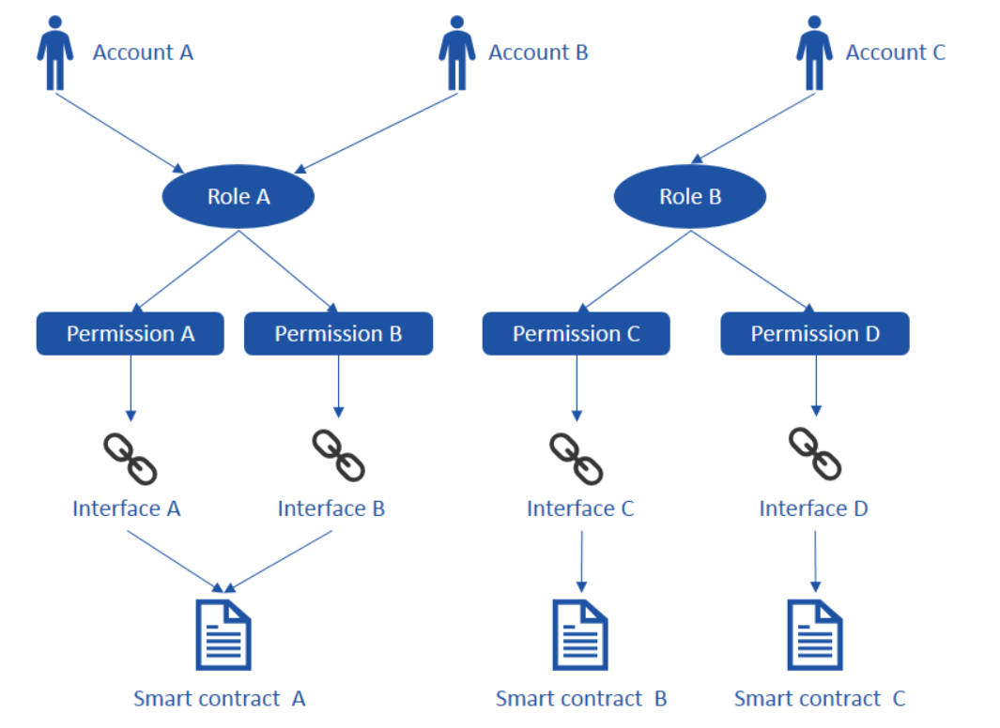
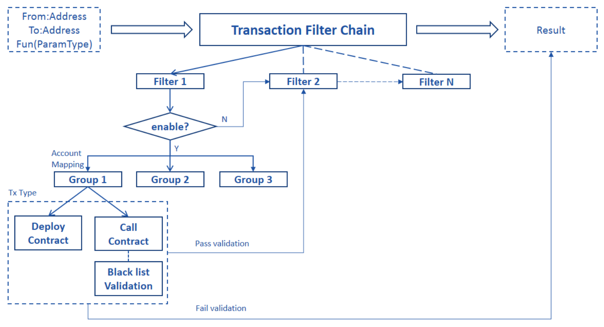

# FISCO BCOS Permission Model
**Author: fisco-dev**  
## Introduction to Permission Model - ARPI 

Unlike public chain which anyone can access, transact and search, the consortium chain has the specific entry requirements. There are two key aspects in the consortium chain: "permission" and "control"

The permission model ARPI(Account—Role—Permission—Interface) is based on the thought of **system level permission** and **interface level permission**. 

System level permission controls whether an account can deploy or call a contract. When a request is received, the system will check the sender's permissions and will permit or reject accordingly. Interface level permission controls whether an account can call a specific interface of a contract. The admin can give an account the permissions to call all or part of the interfaces of a contract.

In the ARPI model, there are 4 objects - **Account, Role, Permission and Interface**, their relationship as below:

**Account : Role -> N : 1**

An account (person or organization) can only have one role, but a role can contain zero to more than one account. In practice, a role may have multiple accounts with different pair of public and private key for each. ???When the sender creates a transaction, it will go through a series of filter which will look at the role/group and will fail if sender is not under it.

?
When a transaction starts, the sender signs the transaction with its private key, and then the receiver can verify it by using sender's public key to know which account the transaction is submitted, so that the transaction can be controlled and traced.


**Role : Permission -> N : N**

A role can have multiple permissions and a permission can under multiple roles. You can have fine granuarlity of permission control under the ARPI model. You can set permissionon the contract's function. ????Can we set on contract level (* function)

ARPI objects relationship as below:    
 

## ARPI Framework Implementation

TransactionFilterChain contract is deployed along with system proxy contract during initialization, and it is registered by system proxy contract at the same time. All the permissions' CRUD is maintained by TransactionFilterChain on blockchain. When a request is received, the system will check whether the sender's account has permissions to the corresponding operations, if yes, then executes it, otherwise throws exception. 

ARPI process flow as below:


Two general types of permissions:
1. **deploy contract**: only the approved contract can be deployed on the chain for execution.?????
2. **call contract**: accounts with permission to the smart contract/interface/abstract????? can call it to execute the business trasaction

More details of the process flow describe as below:
1. TransactionFilterChain includes multiple independent filters with its owned filtering logic. An account will have the specific permissions if it passes all filters’ validation. A filter can be managed by a member of the consortium and the permissions can be added independently.
2. Each filter has a toggle, the filter is effected only when the toggle is switch on. By default, the toggle is off during the initialization.
3. There are different groups within a filter, when the filter is executed, the corresponding group (with its permissions) will be found based on the sender's account.
4. The Group determines the permissions of deploying contract or calling contract. The one input - sender's address is needed for deploying a contract. And four inputs - sender's address, contract address, function and the parameters are required for calling a contract. By default, the group don’t have the permission of deploying contract during initialization.
5. There is a black list validation within calling a contract. if the black list mode is on, no permission will be returned although an account has permission to an interface if the user was added into the black list. By default, the black list mode is off.
6. An interface is composited by a function name with its parameters.
7. The address will be changed once a contract get redeploy, so the permissions of the contract need to be re-granted.

## ARPI practice on consortium chain
Roles and Permissions are generally related to scenarios, there will have different roles and permissions design based on different business requirement. Based on the practice on FISCO BCOS, here let's list out the definitions of roles and permissions for reference:

* Chain Super manager (God account)
A chain super manager is selected by the consortium committee or public, who have all the access to the system. The role for those people **have permissions**: assign roles to users, add permissions to roles, which includes the permissions for all the operations. The God account is required to execute the system contracts.

* Chain/Filter manager
A chain/filter manager can act as admin of a filter to audit, modify and delete information of nodes, accounts and contracts on the chain. The role for those people **have permissions**: execute the system contracts – CAAction, NodeAction, ContractABIAction and SystemProxy.

* Operation manager
An operation manager is a person who deploys/manages the non-system contracts and nodes configuration, but doesn’t participate in business transaction. The role for those people **have permissions**: execute ConfigAction, deploy non-system contracts (except for SystemProxy, which is needed its help to get ConfigAction). For the non-system contracts, there is a need for the chain manager to call ContractABIAction for making the contract effective (can be called by name rather than called by address, so call DNS)

* Trader
A Trader is a person who uses the system do conduct business transactions and query the results, the role here can be subdivided based on different business requirement. The role for those people **have permissions**: execute and query business contracts.

* Chain regulator (Optional to be a group)
A regulator is a person who responsible for setting up the permission specifications. The person usually is not participant in chain's management, but can participant in the business transactions. The role for those people **have permissions**: trace the operation records (The inputs for deploying and calling the contracts will be recorded by Event notification, which can be used for audit purpose)

## Utilities
1. ARPI_Model.js under folder systemcontract, provides one click to start the ARPI mode which includes enabling access control and setting up the roles and permissions according to the previous section **3. ARPI practice on consortium chain**.

>Note: The access control will be enabled after the one click, you can disable it by using the GOD account if you don’t need it, otherwise might impact the other account to deploy and call contracts by accident.

2. AuthorityManager.js under the same folder systemcontract, used to manage TransactionFilterChain and provides the query interfaces to FilterChain, Filter, and Group. 

>Note: AuthorityManager.js and ARPI_Model.js execution required God account.

*   FilterChain can be obtained without index. FilterChain provides the functions to add, delete, show and reset a filter on the chain. The commands as below:
```
babel-node AuthorityManager.js FilterChain addFilter <filter name><version><description>
babel-node AuthorityManager.js FilterChain delFilter <index>
babel-node AuthorityManager.js FilterChain showFilter
babel-node AuthorityManager.js FilterChain resetFilter
```
*   Filter can be obtained with its index from FilterChain. Filter provides the functions 1) to enable, disable, display status of a filter. 2) to add an account to a new or existing group. 3) to display the group of a given account. The commands as below:
```
babel-node AuthorityManager.js Filter getFilterStatus <filter's index>
babel-node AuthorityManager.js Filter enableFilter <filter's index>
babel-node AuthorityManager.js Filter disableFilter <filter's index>
babel-node AuthorityManager.js Filter setUsertoNewGroup <filter's index> <user's account>
babel-node AuthorityManager.js Filter setUsertoExistingGroup <filter's index> <user's account> <group's address>
babel-node AuthorityManager.js Filter listUserGroup <filter's index> <user's account>
```
*   Group can be obtained with the filter's index in the FilterChain and its binding user's account. Group provides the functions to maintain its permission list, enable/disable the permission for deploying contract and verifying black list. The commands as below:
```
babel-node AuthorityManager.js Group getBlackStatus <filter's index> <user's account>
babel-node AuthorityManager.js Group enableBlack <filter's index> <user's account>
babel-node AuthorityManager.js Group disableBlack <filter's index> <user's account>
babel-node AuthorityManager.js Group getDeployStatus <filter's index> <user's account>
babel-node AuthorityManager.js Group enableDeploy <filter's index> <user's account>
babel-node AuthorityManager.js Group disableDeploy <filter's index> <user's account>
babel-node AuthorityManager.js Group addPermission <filter's index> <user's account> <contract address> <fun name(parameters)>
babel-node AuthorityManager.js Group delPermission <filter's index> <user's account> <contract address> <fun name(parameters)>
babel-node AuthorityManager.js Group checkPermission <filter's index> <user's account> <contract address> <func name(parameters)>
babel-node AuthorityManager.js Group listPermission <filter's index> <user's account>
```

3. Prompt for missing the permissions   

The following error is raised if no permission to deploy a contract:   
`Transaction failed to send!  Error: NoDeployPermission .`   

The following error is raised if no permission to call a contract:   
`Transaction failed to send!  Error: NoTxPermission .`   
Or   
`Error: NoCallPermission .`   

4. An example for using AuthorityManager.js as below (to avoid unexpect exception, please make sure the account configured in config.js is the God account)

```
//Add a filter to FilterChain with 3 parameters – filter name, version and description.  
babel-node AuthorityManager.js FilterChain addFilter NewFilter 2.0 FilterUsedForTest

//Delete a filter from FilterChain with its index   
babel-node AuthorityManager.js FilterChain delFilter 1

//Display all filters on FilterChain   
babel-node AuthorityManager.js FilterChain showFilter

//Reset FilterChain to its initialize status   
babel-node AuthorityManager.js FilterChain resetFilter

//Display a filter's status with its index   
babel-node AuthorityManager.js Filter getFilterStatus 1

//Enable a filter with its index   
babel-node AuthorityManager.js Filter enableFilter 1

//Disable a filter with its index   
babel-node AuthorityManager.js Filter disableFilter 1

//Grant a new role(group) to an account with two parameters – filter's index and user's account   
babel-node AuthorityManager.js Filter setUsertoNewGroup 0 0x4015bd4dd8767d568fc54cf6d0817ecc95d166d9

//Grant an existing role(group) to an account with 3 parameters – filter's index, user's account and group's address (the group's address is getting from command 'listUserGroup' after the group have been created by command 'setUsertoNewGroup')   
babel-node AuthorityManager.js Filter setUsertoExistingGroup 0 0x6ea2ae822657da5e2d970309b106207746b7b6b3 Group.address

//Display the role(group) of an user's account with 2 parameters – filter's index and user's account   
babel-node AuthorityManager.js Filter listUserGroup 0 0x4015bd4dd8767d568fc54cf6d0817ecc95d166d9

// Display the status of black list mode with 2 parameters – filer's index and group's address   
babel-node AuthorityManager.js Group getBlackStatus 1 0x4015bd4dd8767d568fc54cf6d0817ecc95d166d9

// Enable black list validation with 2 parameters – filer's index and group's address   
babel-node AuthorityManager.js Group enableBlack 1 0x4015bd4dd8767d568fc54cf6d0817ecc95d166d9

// Disable black list validation with 2 parameters – filer's index and group's address   
babel-node AuthorityManager.js Group disableBlack 1 0x4015bd4dd8767d568fc54cf6d0817ecc95d166d9

// Display the permission status of deploying contract with 2 parameters - filer's index and group's address   
babel-node AuthorityManager.js Group getDeployStatus 1 0x4015bd4dd8767d568fc54cf6d0817ecc95d166d9

// Enable the permission of deploying contract with 2 parameters - filer's index and group's address   
babel-node AuthorityManager.js Group enableDeploy 1 0x4015bd4dd8767d568fc54cf6d0817ecc95d166d9

// Disable the permission of deploying contract with 2 parameters - filer's index and group's address   
babel-node AuthorityManager.js Group disableDeploy 1 0x4015bd4dd8767d568fc54cf6d0817ecc95d166d9

// Add the permissions to a group with 4 parameters - filer's index and group's address, contract's address and contract's interface   
>Note: the contract's address here is the real address rather than the DNS name, so the permission need to be re-granted if the contract get re-deployed   
babel-node AuthorityManager.js Group addPermission 1 0x4015bd4dd8767d568fc54cf6d0817ecc95d166d9 ContractA.address "set1(string)"

//Delete the permissions from a Group with 4 parameters - filer's index and Group's address, contract's address and contract's interface   
babel-node AuthorityManager.js Group delPermission 1 0x4015bd4dd8767d568fc54cf6d0817ecc95d166d9 ContractA.address "set1(string)"

//Check if the permissions of a Group exist with 4 parameters - filer's index and Group's address, contract's address and contract's interface   
babel-node AuthorityManager.js Group checkPermission 1 0x4015bd4dd8767d568fc54cf6d0817ecc95d166d9 ContractA.address "set1(string)"

//List the permissions of a group with 2 parameters - filer's index and group's address   
babel-node AuthorityManager.js Group listPermission 1 0x4015bd4dd8767d568fc54cf6d0817ecc95d166d9
```

Account/Role
| Jordan | Int Team |

Role/Permission
| Int Team | ReadIntDocs|

Permission/Contract
| ReadIntDocs | abc.sol,0x2132421, |

Contract/Permission
| abc.sol | ReadIntDocs |
| abc.sol | ReadIntDocs1 |
| abc.sol | ReadIntDocs3 |
| 0x2132421 | ReadIntDocs |
