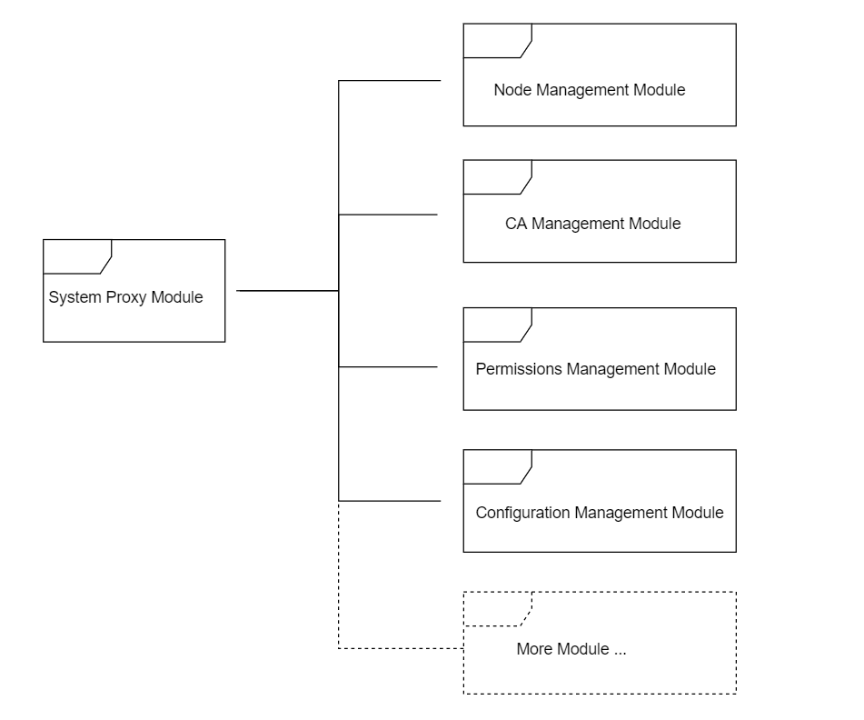

# FISCO BCOS System Contract Introduction
**Author:fisco-dev**  

<!-- TOC -->

- [FISCO BCOS System Contract Introduction](#fisco-bcos-system-contract-introduction)
    - [Design Overview](#design-overview)
    - [How it works](#how-it-works)
        - [System Proxy](#system-proxy)
        - [Node Management](#node-management)
        - [CA Management](#ca-management)
        - [Permissions Management](#permissions-management)
        - [Configuration Management](#configuration-management)
    - [Custom Scalability](#custom-scalability)
        - [Example 1 - Custom Business Configured Contract](#example-1---custom-business-configured-contract)
        - [Example 2 - Custom Business Permissions Filter Contract](#example-2---custom-business-permissions-filter-contract)

<!-- /TOC -->

## Design Overview

To meet the requirements of access control, identity authentication, configuration management, permissions management and etc., FISCO BCOS will deploy the system contract which is a set of powerful, flexible and supporting custom scalability smart contracts when initial the network.

The system contract is implemented by the blockchain admin when initial the network. If system contract needs to upgrade after implementation, admin needs get all blockchain nodes' agreement.

FISCO BCOS system contract has five modules: System Proxy, Node Management, CA Management, Permissions Management and Configuration Management, and system contracts is scalable, also it can be used for both blockchain core and DAPP. Each module is implemented by one or more smart contracts. The structure is as follows:



## How it works

The system contract implementation covers five modules includes System Proxy, Node Management, CA Management, Permissions Management and Configuration Management, code path is: systemcontractv2/.

### System Proxy

SystemProxy.sol, the system proxy's implementation, implements a mapping service between routes and contract address and provides a unified entrace. The internal implementation is that proxy is maintained by _routes. The proxy data structure:

```python
struct SystemContract {
    address _addr;		#contract adress
    bool _cache;		#cache flag
    uint _blocknumber;		#block height
}	
```

Key functions:

| function       | input parameters                                     | output parameters                                   | description                   |
| -------- | :--------------------------------------- | -------------------------------------- | -------------------- |
| getRoute | string key#route name                          | address#contract address<br>bool#catch flag<br>uint # block height | get route information               |
| setRoute | string key#route name<br>address addr#contract address<br>bool cache#cache flag<br>unit blocknumber #block height | N/A                                      | set route<br>overwrite if route name exists |


### Node Management

NodeAction.sol, the node management's implementation, implements nodes' registration, management and maintenance. Node joins or quits the chain must controled by node management contract.
There are three type node in FISCO BCOS: core node, full node, and light node.

```solidity
enum NodeType{
        None,
        Core,
        Full,
        Light
    }
```

The node information data structure:

```python
struct NodeInfo{
        string id;
        string ip;
        uint port;
        NodeType category;
        string desc;
        string CAhash;
        string agencyinfo;
        uint idx;
        uint blocknumber;       #block height
    }
```

Key functions:

| function           | input parameters                                     | output parameters       | description                  |
| ------------ | :--------------------------------------- | ---------- | ------------------- |
| registerNode | string _id<br>string _ip<br>uint _port<br>NodeType _category<br>string _desc<br>string _CAhash<br>string _agencyinfo<br>uint _idx | bool #result | register node<br>Ignore if the node exists |
| cancelNode   | string _id                   | bool #result | cancel node<br>Ignore if the node not exists  |


### CA Management

CAAction.sol, the CA management's implementation, implements nodes' certificate registration, management and maintenance. Node joins or quits the chain must controled by CA management contract if certificate verification enabled.

Certificate data structure:

```python
struct CaInfo{
        string  hash;		#certificate hash
        string pubkey;		#certificate public key
        string orgname;		#organization name
        uint notbefore;		#certificate effictive date
        uint notafter;		#certificate expire date
        CaStatus status;	#certificate status
        string    whitelist;	#IP whitelist
        string    blacklist;	#IP blacklist
        uint    blocknumber;	#block height
      }
```

Key functions:

| function     | input parameters                                     | output parameters                                     | description                        |
| ------ | ---------------------------------------- | ---------------------------------------- | ------------------------- |
| update | string _hash<br>string _pubkey<br>string _orgname<br>uint _notbefore<br>uint _notafter<br>CaStatus _status<br>string _whitelist<br>string _blacklist | bool #result                               | update certificate<br>create certificate if certificate not exists |
| get    | string _hash                        | string#certificate hash<br>string#certificate public key<br>string#organization name<br>uint#certificate effictive date<br>uint#certificate expire date<br>CaStatus#certificate status<br>uint##block height | get certificate information                    |


### Permissions Management

FISCO BCOS has 3 key rules: 1, One external account only belongs to one role. 2, One role only has one permission list. 3, Contract address and contract interface uniquely identify a permission.

Key smart contracts: [TransactionFilterChain.sol](https://github.com/FISCO-BCOS/FISCO-BCOS/blob/master/systemcontract/TransactionFilterChain.sol), [TransactionFilterBase.sol](https://github.com/FISCO-BCOS/FISCO-BCOS/blob/master/systemcontract/TransactionFilterBase.sol), [AuthorityFilter.sol](https://github.com/FISCO-BCOS/FISCO-BCOS/blob/master/systemcontract/AuthorityFilter.sol), [Group.sol](https://github.com/FISCO-BCOS/FISCO-BCOS/blob/master/systemcontract/Group.sol).

TransactionFilterChain.sol, the implementation of Filter model, processes filter contract address list by inheriting TransactionFilterBase. and it exposes a unified 'process' method for permission checking. 'process' will be called by every contract which in Filter contract address list for permission checking.

TransactionFilterBase.sol, the base contract, every inherited Filter has to call the base process method.

AuthorityFilter, inherting TransactionFilterBase, checks user group's permission.

Group.sol handle role permission's mapping flag.

Key functions:

| contract                   | function            | input parameters                                     | output parameters      | description      |
| --------------------- | ------------- | ---------------------------------------- | --------- | ------- |
| TransactionFilterBase | process       | address origin #external address, address from#from account address, address to#to account address, string func#contract address, string input#transaction input| bool#result | permission checking    |
| Group                 | setPermission | address to, string func, bool perrmission#to account address, contract address, permission flag | bool#result | set permission |


### Configuration Management

ConfigAction.sol, the configuration management implementation, manages all the configurable information. The configuration is consistent on the chain by broadcasting transaction and only the blockchain admin can make the transaction.

Key functions:

| function   | input parameters                              | output parameters                     | description    |
| ---- | --------------------------------- | ------------------------ | ----- |
| set  | string key #item<br>string value#config information value | N/A                        | set configuration |
| get  | string key #item                   | string #config information<br> uint#block height | get configuration |

key items:

| item                  | description                           | default value       | recommend value         |
| -------------------- | ---------------------------- | --------- | ----------- |
| maxBlockHeadGas      | block max GAS (Hex)                | 200000000 | 20000000000 |
| intervalBlockTime    | block interval time(ms) (Hex)               | 1000      | 1000        |
| maxBlockTranscations | block max transactions(Hex)                 | 1000      | 1000        |
| maxNonceCheckBlock   | max transaction nonce(Hex)         | 1000      | 1000        |
| maxBlockLimit        | max block offset(Hex) | 1000      | 1000        |
| maxTranscationGas    | max transaction gas(Hex)               | 20000000  | 20000000    |
| CAVerify             | CA verification flag                       | FALSE     | FALSE       |

## Custom Scalability

### Example 1 - Custom Business Configured Contract

For the case like customized business-related smart contract:

1. Custom 'set' and 'get' base on business requirement.
2. Deploy business contract and get contract address.
3. Call SystemProxy exposed method 'setRoute' to register contract to proxy.
4. Business smart contract works.

how to use the business contract:

1. Call SystemProxy exposed method 'getRoute' to get contract address.
2. Pass contract address as parameter to 'get' method to get configuration information.

### Example 2 - Custom Business Permissions Filter Contract

For the case like extra
假设业务需要增加业务权限校验逻辑, 则可以利用权限管理合约的Filter机制来无缝扩展.大体可以参考以下步骤来扩展:

1. 继承于TransactionFilterBase实现一个业务权限Filter合约, 业务权限Filter合约根据业务需要的权限校验逻辑实现process接口.
2. 部署业务权限Filter合约, 获得对应的contract address.
3. 调用System ProxySystemProxy的getRoute接口, 获得TransactionFilterChaincontract address.
4. 调用TransactionFilterChain合约的addFilter接口, 将业务权限Filtercontract address注册到Filter合约列表中.
5. 至此, 业务权限Filter合约已经启用.


