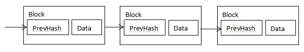

# Multi-Node Parallel Practical Byzantine Fault Tolerance Consensus
**Author: fisco-dev**  

## 1. Glossary
### Blockchain:   
Blockchain is a growing list of records, called blocks, which are linked using cryptography. Each block contains current block data and a cryptographic hash of the previous block. There are two key concepts of blockchain: cryptography and decentralization. Based on there two key concepts, the block data can not be tampered. 
A block contains block head and block body. The block head contains the block height(h), previous block hash(prevHash) and etc, and the block body mainly contains transaction data.
  
### P2P(peer-to-peer) network: 
Unlike traditional centralized networks, P2P networks is that participants make up a network through P2P protocols, and participants are peers. P2P network has the following advantages:
1. **Decentralization**: No need centralized server any more, resources and servers are separated on nodes and all the data transfer and service happens between nodes.
2. **Robustness**: Node joins or quits the blockchain will not impact network service.
3. **Extensibility**: Support for extending nodes to extend the system. For example, based on the P2P protocol file download, more users join, faster speed for download.
4. **Cost-effective**: In the P2P network,The nodes are generally ordinary machines and use the ordinary machines to build the entire network system for industrial level service, so it has a considerable cost advantage. 
### Node: 
In a P2P network, every participant is a node and the nodes constitute the blockchain. In a blockchain P2P network, a node is a uniquely-identified participant with a complete ledger copy, and able to participate in consensus and account maintenance.
### Consensus: 
Every node in the blockchain P2P network confirms a batch of transactions by an algorithm and ensures that all nodes have consistent confirmation results for the batch of transactions. This algorithm is a blockchain consensus.
### Byzantine Fault Tolerant(BFT): 
Byzantine fault tolerance comes from the Byzantine general problem. In a P2P network system, nodes may operate in any form, includes jointly to be evil. As long as the number of such faulty nodes is within a certain range and the system is still functioning properly, means the system has Byzantine fault tolerance.

## 2. 传统共识算法介绍
### 2.1传统技术方案
现有区块链的共识算法主要包括工作量证明（POW）、权益证明（POS）、委托权益证明（DPOS）以及可用拜占庭容错算法（PBFT）等, 其中POW、POS、DPOS主要适用于比特币等公有链, 而PBFT是一种适用于传统分布式系统的拜占庭容错算法, 通过三轮广播通信完成共识算法.   
 
### 2.2传统共识算法不足
- POW通过算力竞争获得共识, 造成大量能源消耗, 而且这种算法会导致出块时间不稳定；
- POS、DPOS需要通过代币数量来控制共识, 容易造成代币集中化, 使得共识被少数人控制, 少数人可以联合作恶破坏网络；
- PBFT是一种可用的拜占庭容错算法, 但是由于该算法的三个阶段是串行执行, 存在共识效率低的问题. 

## 3. 应用于区块链的多节点并行拜占庭容错共识算法
### 3.1 节点角色
区块链节点的角色有两种, 分别是“领导节点”和“随从节点”. 
- 领导节点: 负责对交易进行打包成块, 把块广播给其他节点, 通过共识过程对块中所有交易进行确认, 从而使得区块链的区块高度不断增加. 
- 随从节点: 负责接收从领导节点发送来的区块, 对区块中的交易进行确认, 所有交易都确认完毕就对该块进行签名验证, 从而使共识达成. 
### 3.2 角色变迁
在本算法中, 节点的角色不是固定不变的, 随着时间迁移节点角色也会进行变迁. 
区块链网络由一个个节点组成, 假设一共有N个节点, 对节点从0,1,2...N-1进行编号, 每个节点对应一个唯一的Idx(i). 一个节点的角色判断通过公式 （h+v）%N 来决定, 其中h是区块链当前块高度, v是当前视图（视图的定义在3.4节会详细阐述）.   
角色变迁图如下所示:   
 
### 3.3 共识过程
共识过程就是区块链网络对一批交易进行确认, 并达到全网一致的过程. 共识过程分为以下几个阶段:   
1. 选举领导: 通过3.2描述的算法推选出一个领导, 有别于其他基于投票选举领导的算法, 在本专利中是通过共识计算选出合适的领导, 这种方式具有更高的效率.   
2. 打包验证交易: 选举出的领导节点, 将会一批交易进行打包验证, 组成一个区块, 区块的产生也就由领导节点负责.   
3. 签名投票: 随从节点对领导节点发送来的区块, 进行每一笔交易确认验证, 全部通过之后发送对该块的一个投票签名.   
4. 落盘投票: 所有节点在收到2/3以上节点的签名投票之后, 广播落盘投票.   
5. 落盘提交: 所有节点在收到2/3以上节点额落盘投票之后, 把该块进行落盘存储.     
  
###  3.4 异常处理机制
在3.3的描述的共识过程几个阶段, 每个阶段都有可能因为出现错误、超时或者故意作恶等各种原因致使无法顺利进入下一个阶段, 从而使共识无法达成. 本专利引入异常处理机制解决这种问题.   
把一次共识共识的全过程定义为一个视图, 所有阶段需要在同一个视图下完成.   
当一个节点完成块h的落盘存储之后, 意味着它就需要开始块h+1的共识过程, 此时会对块h+1的共识设置一个超时器, 当到达超时还未完成共识过程就会引起视图切换过程. 视图切换的过程首先是将自己的视图v++, 然后把v全网广播告知所有节点, 如果收到2/3以上节点都有相同的视图v切换请求, 就顺利切换到下一个视图.   
   
### 3.5 并行机制
在3.3介绍的共识过程中, 打包验证交易和验证交易分别是领导节点和随从节点对交易进行确认的操作, 这是整个共识过程中最耗时的环节. 从图中可以看出, 打包验证交易和验证交易是串行执行的, 首先要由领导节点完成打包验证交易, 随从节点的验证交易才能开始进行, 假设交易确认耗时为T, 其他过程总耗时为T’, 那么整个共识的耗时就为2*T+T’. 本专利对交易确认机制提出并行化的改进设计, 整体共识耗时降为T+T’, 大大提高了共识效率.   
  
