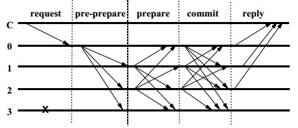
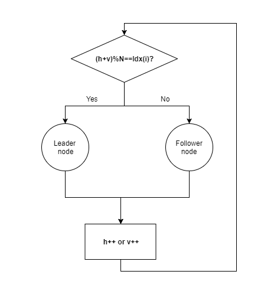

# Multi-Node Parallel Practical Byzantine Fault Tolerance Consensus Algorithm
**Author: fisco-dev**  

## 1. Glossary
### Blockchain:   
Blockchain is a growing list of records, called blocks, which are linked using cryptography. Each block contains current block data and a cryptographic hash of the previous block. There are two key concepts of blockchain: cryptography and decentralization. Based on there two key concepts, the block data can not be tampered. 
A block contains block head and block body. The block head contains the block height(h), previous block hash(prevHash) and etc., and the block body mainly contains transaction data.
 
  
### P2P(peer-to-peer) network: 
Unlike traditional centralized networks, P2P networks is that participants make up a network through P2P protocols, and participants are peers. P2P network has the following advantages:
1. **Decentralization**: No need centralized server any more, resources and servers are separated on nodes and all the data transfer and service happens between nodes.
2. **Robustness**: Node joins or quits the blockchain will not impact network service.
3. **Extensibility**: Support for extending nodes to extend the system. For example, based on the P2P protocol file download, more users join, faster speed for download.
4. **Cost-effective**: In the P2P network,The nodes are generally ordinary machines and use the ordinary machines to build the entire network system for industrial level service, so it has a considerable cost advantage. 
### Node: 
In a P2P network, every participant is a node and the nodes constitute the blockchain. In a blockchain P2P network, a node is a uniquely-identified participant with a complete ledger copy, and able to participate in consensus and account maintenance.
### Consensus algorithm: 
Every node in the blockchain P2P network confirms a batch of transactions by an algorithm and ensures that all nodes have consistent confirmation results for the batch of transactions. This algorithm is a blockchain consensus.
### Byzantine Fault Tolerant(BFT): 
Byzantine fault tolerance comes from the Byzantine general problem. In a P2P network system, nodes may operate in any form, includes jointly to be evil. As long as the number of such faulty nodes is within a certain range and the system is still functioning properly, means the system has Byzantine fault tolerance.

## 2. Brief to existing consensus algorithm
### 2.1 Existing consensus
The existing consensus algorithms of blockchain mainly include Proof of Work(POW), Proof of Stake(POS), Delegated Proof of Stake(DPOS) and Practical Byzantine Fault Tolerance(PBFT). Among consensus algorithms, POW, POS, DPOS are mainly used for public chains like bitcoin, but PBFT is used for traditional distributed systems, which accomplishes the consensus algorithm through three rounds of broadcast communication.   
 
### 2.2 Insufficient calculation of existing consensus algorithm
- POW build consensus through computation, so it causing a lot of energy consumption also unstable block generating time.
- POS、DPOS build consensus by using token, so it may easy to cause the tokens to be centralized, so that the consensus is controlled by a few people, and a few people can work together to destroy the network;
- PBFT algorithm's three phases are serial computing so consensus efficiency is low.

## 3. Multi-Node Parallel Practical Byzantine Fault Tolerance Consensus Algorithm
### 3.1 Node Roles
- Leader node: Leader packages and broadcasts the block to other nodes. Transactions in the block are verified by consensus algorithm and after verification the block height will increase.
- Follower node: Followers receive block from the leader node and confirm whether the transaction is valid, followers will sign the signature to the block when the nodes agree on a block., then the consensus process is done.
### 3.2 Node's role transition
In PBFT, node's role is changed as time going.
As we known that bloclchain build up by nodes, assume that there are N nodes totally, and each node has a unique index: Idx(i). and node's role is decided by a formula: (h+v)%N. h is the current block height, v is the current view(more information about view in section  [3.4 Exception handling](#exception-handling)).
 
### 3.3 Consensus decision-making

Consensus decision-making is a group decision-making process, and agree to support a decision of the whole. Consensus decision-making has following steps:
1. Leader election: Use the algorithm mentioned in section 3.2 to elect a leader. Compare with the traditional leader election algorithm, the patent algorithm holds by FISCO BCOS is more efficient.
2. Package transaction: Leader packages and creats a new block, then broadcasts the block to other nodes.
3. Sign: Followers receive block from the leader node and confirm whether the transaction is valid, followers will sign the signature to the block when the nodes agree on a block.
4. Vote: If more than 2/3 of all nodes sign the transaction, then broadcast it.
5. Data to disk: If more than 2/3 of all nodes vote, then store the data to disk.
 
  
###  3.4 Exception handling
在3.3的描述的共识过程几个阶段, 每个阶段都有可能因为出现错误、超时或者故意作恶等各种原因致使无法顺利进入下一个阶段, 从而使共识无法达成. 本专利引入异常处理机制解决这种问题.   
把一次共识共识的全过程定义为一个视图, 所有阶段需要在同一个视图下完成.   
当一个节点完成块h的落盘存储之后, 意味着它就需要开始块h+1的共识过程, 此时会对块h+1的共识设置一个超时器, 当到达超时还未完成共识过程就会引起视图切换过程. 视图切换的过程首先是将自己的视图v++, 然后把v全网广播告知所有节点, 如果收到2/3以上节点都有相同的视图v切换请求, 就顺利切换到下一个视图.   
   
### 3.5 并行机制
在3.3介绍的共识过程中, 打包验证交易和验证交易分别是领导节点和随从节点对交易进行确认的操作, 这是整个共识过程中最耗时的环节. 从图中可以看出, 打包验证交易和验证交易是串行执行的, 首先要由领导节点完成打包验证交易, 随从节点的验证交易才能开始进行, 假设交易确认耗时为T, 其他过程总耗时为T’, 那么整个共识的耗时就为2*T+T’. 本专利对交易确认机制提出并行化的改进设计, 整体共识耗时降为T+T’, 大大提高了共识效率.   
  
