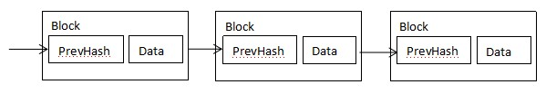
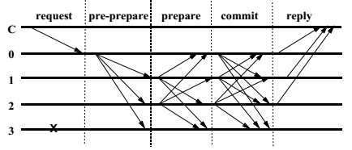
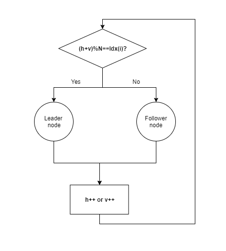
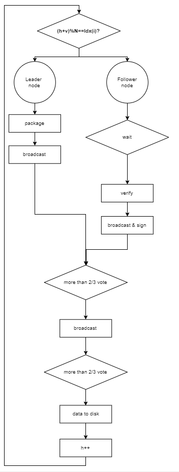
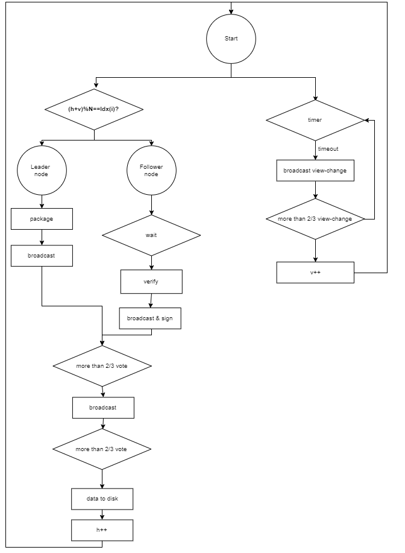
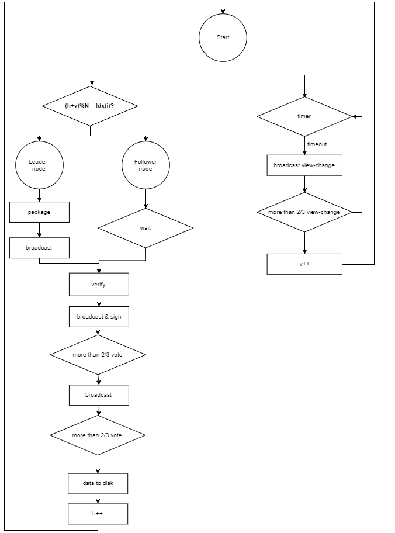

# Parallel Practical Byzantine Fault Tolerance Consensus Algorithm
**Author: fisco-dev**  

## 1. Glossary
### Blockchain:   
Blockchain is a growing list of records, called blocks, which are linked using cryptography. Each block contains current block data and a cryptographic hash of the previous block. There are two key concepts of blockchain: cryptography and decentralization. Based on these two key concepts, the block data cannot be tampered. 
A block contains block head and block body. The block head contains the block height(h), previous block hash(prevHash) etc., and the block body mainly contains transaction data.
 
  
### P2P(peer-to-peer) network: 
Unlike traditional centralized networks, P2P networks is that participants make up a network through P2P protocols, and participants are peers. P2P network has the following advantages:
1. **Decentralization**: No need centralized server any more, resources and servers are separated on nodes and all the data transfer and service happens between nodes.
2. **Robustness**: Node joins or quits the blockchain will not impact network service.
3. **Extensibility**: Support for extending nodes to extend the system. For example, based on the P2P protocol file download, more users join, faster speed for download.
4. **Cost-effective**: In the P2P network, the nodes are generally ordinary machines and use the ordinary machines to build the entire network system for industrial level service, so it has a considerable cost advantage. 
### Node: 
In a P2P network, every participant is a node and the nodes constitute the blockchain. In a blockchain P2P network, a node is a uniquely-identified participant with a complete ledger copy, and able to participate in consensus and account maintenance.
### Consensus algorithm: 
Every node in the blockchain P2P network confirms a batch of transactions by an algorithm and ensures that all nodes have consistent confirmation results for the batch of transactions. This algorithm is a blockchain consensus.
### Byzantine Fault Tolerant(BFT): 
Byzantine fault tolerance comes from the Byzantine general problem. In a P2P network system, there is no rules for nodes, even nodes can jointly to be evil. As long as the number of such faulty nodes is within a certain range and the system is still functioning properly, means the system has Byzantine fault tolerance.

## 2. Brief to existing consensus algorithm
### 2.1 Existing consensus
The existing consensus algorithms of blockchain mainly include Proof of Work(POW), Proof of Stake(POS), Delegated Proof of Stake(DPOS) and Practical Byzantine Fault Tolerance(PBFT). Among consensus algorithms, POW, POS, DPOS are mainly used for public chains like bitcoin, but PBFT is used for traditional distributed systems, which accomplishes the consensus algorithm through three rounds of broadcast communication.
 
 
### 2.2 Insufficient calculation of existing consensus algorithm
- POW build consensus through computation, so it is causing a lot of energy consumption also unstable block generating time.
- POS、DPOS build consensus by using token, so it may easy to cause the tokens to be centralized, so that the consensus is controlled by a few people, and a few people can work together to destroy the network;
- PBFT algorithm's three phases are serial computing so consensus efficiency is low.

## 3. Parallel Practical Byzantine Fault Tolerance Consensus Algorithm
### 3.1 Node Roles
- Leader node: Leader packages and broadcasts the block to other nodes. Transactions in the block are verified by consensus algorithm and after verification the block height will increase.
- Follower node: Followers receive block from the leader node and confirm whether the transaction is valid, followers will sign the signature to the block when the nodes agree on a block., then the consensus process is done.
### 3.2 Node's role transition
In PBFT, node's role is changed as time going.
As we known that blockchain build up by nodes, assume that there are N nodes totally, and each node has a unique index: Idx(i). and node's role is decided by a formula: (h+v)%N. h is the current block height, v is the current view(more information about view in section  [3.4 Exception handling](#exception-handling)).
 
 
### 3.3 Consensus decision-making

Consensus decision-making is a group decision-making process, and agree to support a decision of the whole. Consensus decision-making has following steps:
1. Leader election: Use the algorithm mentioned in section 3.2 to elect a leader. Compare with the traditional leader election algorithm, the patent algorithm holds by FISCO BCOS is more efficient.
2. Package transaction: Leader packages and creates a new block, then broadcasts the block to other nodes.
3. Sign: Followers receive block from the leader node and confirm whether the transaction is valid, followers will sign the signature to the block when the nodes agree on a block.
4. Vote: If more than 2/3 of all nodes sign the transaction, then broadcast it.
5. Data to disk: If more than 2/3 of all nodes vote, then store the data to disk.
 
 
###  3.4 Exception handling
In the several stages of the consensus decision-making process described in section 3.3, each stage may be unable to work smoothly due to some reasons such as error, timeout or deliberate evil, thus the consensus decision-making process is failed. FISCO BCOS patent algorithm introduces an exception handling to solve this problem.
A view is one consensus decision-making process life circle. and next view needs to be executed after the current view complete.
A view is one consensus decision-making process life circle. and next view needs to be executed after the current view finished.

When a node completes store block h to disk, it needs to start the consensus process of block h+1. At this time, a timer will be set for consensus process of block h+1. If the consensus process is not completed before timeout, it will execute the view-change process.
The process of view-change is firstly executing v++, and then broadcast v to all nodes. If more than 2/3 nodes receive the request of view v view-change, then switch to the next view.
 
   
### 3.5 Parallel computing
In the consensus process (introduced in section 3.3), the processes of leader node package transaction and follower node verify transaction are the most time-consuming part of the entire consensus process, and these two processes are serial computing. It is assumed that the transaction confirmation time is T, and the total process consumption time is T', so the time spent on the whole consensus is 2*T+T'. FISCO BCOS patent consensus algorithm improves the process like below, so the time spent on the whole consensus reduced to T+T'.
 

