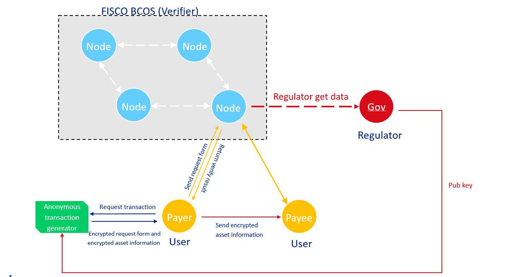

# Regulated Zero-knowledge proof
**Author: fisco-dev**  

To meet the regulation requirement, when FISCO BCOS providing a framework to perform anonymous transaction by zero-knowledge proof, it also satisfies that regulators can regulate every transaction.

## 1. Glossary

**[Zero-knowledge proof](#https://en.wikipedia.org/wiki/Zero-knowledge_proof)**: Let you validate the truth of something without revealing how you know that truth or sharing the content of this truth with the verifier.

**Zero-knowledge proof on blockchain**: A proof, convert from user data, can be shown to blockchain node to proof user knows the data while the proof itself cannot be revert to original data. It helps the node to verify the user data with zero-knowledge about user data. So zero-knowledge proof provides a way to conduct secret transaction on blockchain, while there is a risk to regulator.

**FISCO-BCOS regulated Zero-knowledge proof**: FISCO BCOS node works as verifier for all secret transaction (implemented by zero-knowledge proof) on chain. While all transactions can be ONLY decrypted/watch by certificated regulator.

## 2. Underlying library

[libzkg：Regulated Zero-knowledge proof library](https://github.com/FISCO-BCOS/libzkg)

## 3. Case study

**(1) Regulated one-to-one anonymous transfer**

In FISCO BCOS, one-to-one anonymous transfer can be verified by blockchain node without knowing receiver and sender identity and its amount. In the meantime, regulator can decrypt the anonymous transfer. More details：[zkg-tx1to1](https://github.com/FISCO-BCOS/zkg-tx1to1)

**(2) Coming soon...**