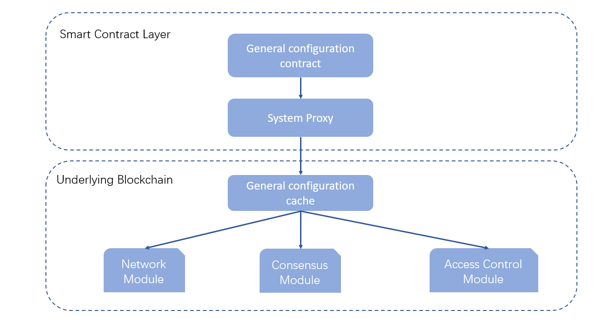

# System Configuration Introduction #
**Author: fisco-dev**   
## Design Overview ##

To make sure the configuration is consistent on all nodes, FISCO BCOS has a system manages the configuration information by smart contract:

## System Configuration List ##
### maxBlockTranscations ###
Description: block max transactions

Value: (0,2000]

Default value: 1000

### intervalBlockTime ###
Description: max block generating interval time(ms)

Value: >= 1,000

Default value: 1,000

### maxBlockHeadGas ###
Description: max block Gas

Value: >= 2,000,000,000

Default value: 2,000,000,000

### maxTranscationGas ###
Description: max transaction Gas

Value: >= 30,000,000

Default value: 30,000,000

### maxNonceCheckBlock ###
Description: max number of blocks checking by Nonce

Value: >= 1000

Default value: 1000

### maxBlockLimit ###
Description: max block offset

Value: >= 1000

Default value: 1000

### CAVerify ###
Description: CA verification flag 

Value: true/false

Default value: false

### omitEmptyBlock ###
Description: ignore empty blocks store to disk

Value: true/false

Default value: true

## How to update configuration ##

> Configuration can be updated on any nodes but recommend using genesis block.

update configuration information: 

    babel-node tool.js ConfigAction set [parameter] [value]

get configuration information: 

    babel-node tool.js ConfigAction get [parameter]

update block generating interval time (Note: get/set needs HEX format parameter)

    cd systemcontractv2;
    babel-node tool.js ConfigAction set  intervalBlockTime 1000

enable empty blocks store to disk

    cd systemcontractv2;
    babel-node tool.js ConfigAction set  omitEmptyBlock false
